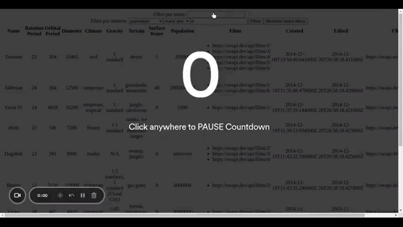

# Projeto 15 - Star Wars Data

Oi. Este foi um dos projetos que eu fiz durante meu curso na Trybe. Confira os detalhes dele abaixo.

## Nome do Projeto
Star Wars Data (Dados de Star Wars)

## Linguagens e Ferramentas Utilizadas

 - JavaScript
 - HTML
 - [Biblioteca React](https://pt-br.reactjs.org/)
 - [React Router](https://reactrouter.com/en/main)
 - Context API e ReactHooks

## Objetivos do Projeto
Neste projeto foi consumida uma [API com dados da série de filmes Star Wars](https://swapi.dev/api/planets) para popular uma tabela. Essa tabela pode ser filtrada pela pessoa usuária por diversas maneiras. O intuito desse projeto foi desenvolver a aplicação utilizando os conceitos aprendidos de [Context API](https://reactjs.org/docs/context.html) e [React Hooks](https://reactjs.org/docs/hooks-intro.html). Habilidades:
 - Utilizar a Context API do React para gerenciar estado.
 - Utilizar o React Hook useState;
 - Utilizar o React Hook useContext;
 - Utilizar o React Hook useEffect;
 - Criar React Hooks customizados.
 - Escrever testes para garantir que sua aplicação possua uma boa cobertura de testes.

 
Abaixo está um GIF que mostra a aplicação funcionando (vale lembrar que o objetivo principal do projeto era desenvolver a aplicação com foco na arquitetura do site utilizando React Hooks e Context API, e, por isso, não foi desenvolvido o CSS, portanto a aplicação está sem estilização).
 

 

## Instruções para visualização
Comando para clonar o projeto:
 - `git clone git@github.com:BrunoSayago/projeto-15-StarWarsData.git`
 
Se necessário, instalar as dependências:
 - `npm install`
  
O projeto pode ser visualizado no navegador utilizando o comando:
- `npm start`
